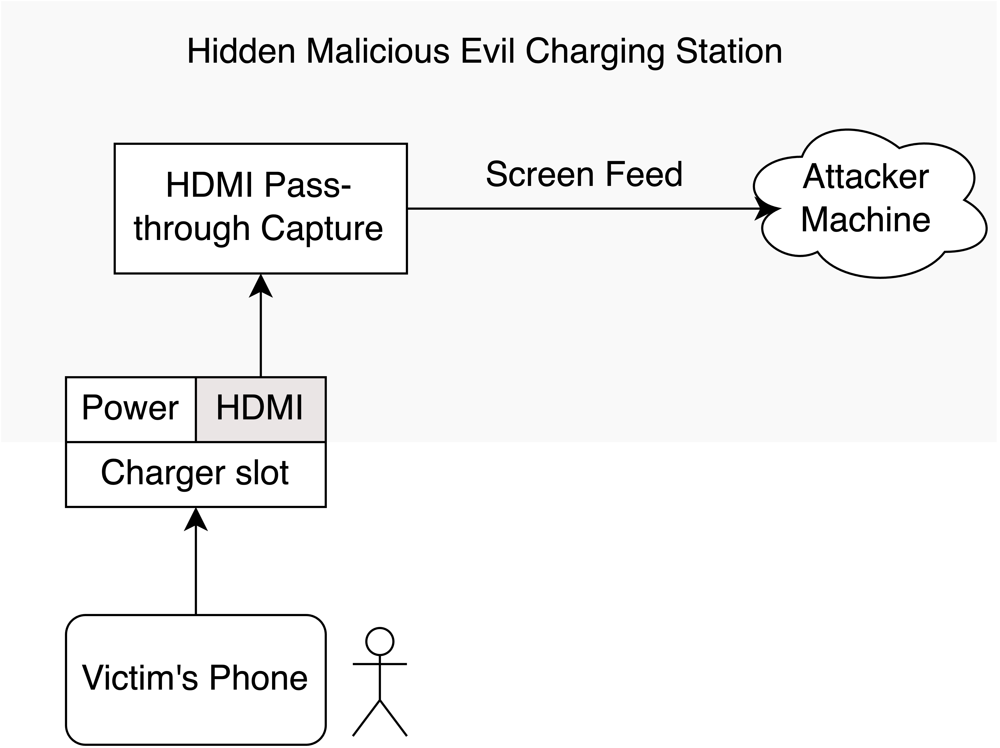

# Evil Phone Charging Station
Codebase for Research Project 2 - Building an Evil Phone Charging Station. 
Author: Tomás Philippart

Attack and threat model/setup:



## Installation:

Simply install the requirements necessary by running:

```console
$ pip3 install -r requirements.txt
```

NOTE: All of the development was done on MacOS Ventura, I cannot confirm that all of the code is cross-platform.

## Usage: 

```console
$ python3 main.py [--mode <usb, video>] --filename <FILENAME> [--framerate <FRAMERATE>, --mode <tesseract|google_vision>]
```

Check ``.txt`` under ``/results`` folder for the processed text.

## Examples

### Capturing from a USB device (like in the attack and threat model setup)

```console
$ python3 main.py --mode usb --filename HDMI_Capture --capture_time 15 --ocr_mode tesseract
Starting frame capture... Press CTRL+C to stop recording frames.
Converting frames to text using tesseract mode...
Writing results to results/HDMI_Capture.txt...
Done!
```

### Converting pre-existing video (screen recording) to processed text

```console
$ python3 main.py --mode video --filename media/instagram_login.mp4 --framerate 5 --ocr_mode tesseract
Converting video to frames: 100%|██████████████████████████████████████████████| 805/805 [00:26<00:00, 30.57frame/s]
Filtering duplicate frames: 100%|████████████████████████████████████████████| 805/805 [00:00<00:00, 1776.90frame/s]
Converting frames to text: 100%|███████████████████████████████████████████████| 515/515 [05:00<00:00,  1.71frame/s]
Results writen to results/instagram_login.txt.
```

## Results

WIP!